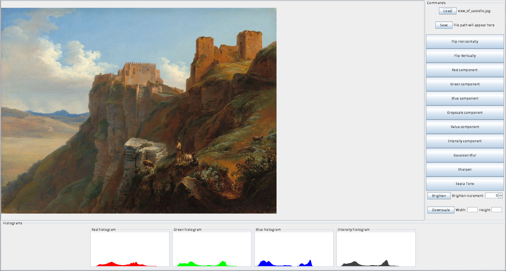

# Program usage

A script demoing all the functionality of the program at present is located at `res/complete_script`.

To run the complete script using the JAR, navigate to the toplevel directory of this project and run:
```bash
java -jar ./res/ood_image_processing.jar -file res/complete_script
```

Alternatively, configure the args via IntelliJ to be:
`-file res/complete_script`.

To run interactively in the command line, run with the `-text` option
and then input commands as you wish until you want to quit with `quit` or `q`.
```bash
java -jar ./res/ood_image_processing.jar -text
```

To run in a graphical user interface mode, run the program without providing any arguments.

### Usage

Program usage is as follows:
```
Usage: [option] ...
-h         : show this help message
-file path : run the provided script file
-text      : run in interactive mode
           : no args to run in GUI mode
```

In script mode the program will execute image processing commands
according to the provided script (see below for scripting).

In interactive mode the program allows the user to enter commands line by line,
and quit by typing `quit` or `q`.

### GUI usage

When the program is run in GUI mode, all the features should be very easy
to understand. However, we provide a brief explanation of it here:
- First, an image has to be loaded. See the red arrow in the screencap below
pointing out the button to press to do this.
- Then any of the buttons in the right panel (besides load and save) can be used to:
  - flip the image vertically.
  - flip the image horizontally.
  - greyscale on the red component.
  - greyscale on the green component.
  - greyscale on the blue component.
  - greyscale on the luma component.
  - greyscale on the value component.
  - greyscale on the intensity component.
  - perform a gaussian blur.
  - sharpen the image.
  - make the image sepia-toned.
  - brighten or dim the image by setting an increment (-255 to 255) and
clicking the brighten button.
  - downscale the image by setting the new dimensions and clicking the downscale button.
- Any time a loaded image is manipulated, the four histogram panels (for the RGB values and
  intensity component) on the bottom will be automatically updated.
- At any point the displayed image can be saved back to the filesystem by pressing
the save button and selecting an output destination with an appropriate filetype
(ppm, png, jpg, or bmp).



### Commands / Scripting

Whether the program is run in script mode or interactive mode, commands are used to
control how images are processed.

#### The available commands are:
```
load <file path> <name>
save <name> <file path>

horizontal-flip <name> <updated name>
vertical-flip   <name> <updated name>

red-component   <name> <updated name>
green-component <name> <updated name>
blue-component  <name> <updated name>

value-component <name> <updated name>
intensity-component <name> <updated name>
luma-component  <name> <updated name>
sepia-tone      <name> <updated name>

gaussian-blur   <name> <updated name>
sharpen         <name> <updated name>

brighten        <name> <updated name> <increment>

downscale       <name> <updated name> <new width> <new height>
```

Where:
- `load <file path> <name>` loads an image from the provided path to a `ppm` file into the program,
  and labels it with the provided name for future reference
- `save <name> <file path>` saves the image with the provided internal name to the provided file path
- The rest of the commands perform their implied action on the image with the given `<name>`,
  and save the result internally with the `<updated name>`
    - Note that `brighten` takes a third argument beyond the standard two,
      and uses it to determine the increment to brighten by.
      This increment can be negative if the user wishes to dim the image.

A script to control the image processing can be typed into any readable file.
Scripts allow for comments, which may be useful to the user.
Any lines starting with `#` are ignored.

There are no restrictions on the order in which commands may be entered, except that the first command
will have to be a load command (before that there are no images in memory), and subsequent commands
must reference names of images saved in memory.

#### Command Masking

Any of these above commands can be done in a "masked" mode, by inputting a final argument beyond
all the required arguments, which is the name of another image loaded in the program. If this is
done, the processing will be done _only on the parts of the original image that are black in the mask_.

#### Example Script

This script shows all of the commands used in context.

```
# load the sample image from a ppm
load res/sample.ppm img

# luma
luma-component img luma-img
# dim
brighten luma-img luma-dim-img -30
# horizontal flip
horizontal-flip luma-dim-img luma-dim-horz-img
# save as a ppm
save luma-dim-horz-img res/luma-dim-horizontal.ppm

# save original image to all other formats (png/jpg/bmp)
save img res/sample.png
save img res/sample.bmp
save img res/sample.jpg

# load from png
load res/sample.png png-img
# sepia-ify the image
sepia-tone png-img sepia-img
save sepia-img res/sepia.png
# vertical flip
vertical-flip sepia-img sepia-vertical-img
# save as png
save sepia-vertical-img res/sepia-vertical.png
# sharpen
sharpen png-img sharp-img
save sharp-img res/sharp.png
# double sharpen
sharpen sharp-img very-sharp-img
save very-sharp-img res/very-sharp.png
# blur
gaussian-blur png-img blurry-img
save blurry-img res/blur.png
# greyscale
luma-component png-img grey-img
save grey-img res/greyscale.png

# load from bmp
load res/sample.bmp bmp-img
# brighten the image
brighten bmp-img bright-img 40
# blur the image
gaussian-blur bright-img blurry-bright-img
# save out
save blurry-bright-img res/blurry-bright.bmp

# load from jpg
load res/sample.jpg jpg-img
# red component
red-component jpg-img red-img
save red-img res/red.jpg
# green component
green-component jpg-img green-img
save green-img res/green.jpg
# blue component
blue-component jpg-img blue-img
save blue-img res/blue.jpg
# value
value-component jpg-img value-img
save value-img res/value.jpg
# intensity
intensity-component jpg-img int-img
save int-img res/intensity.jpg
```

#### Example Images

The images in the `res/` and `test/` directories are of our own creation,
except for `res/view_of_castello.jpg`, which is [in the public domain](https://www.nga.gov/collection/art-object-page.130897.html).
